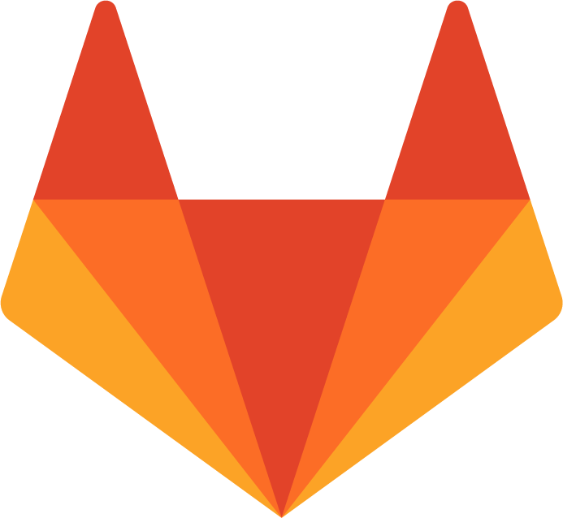
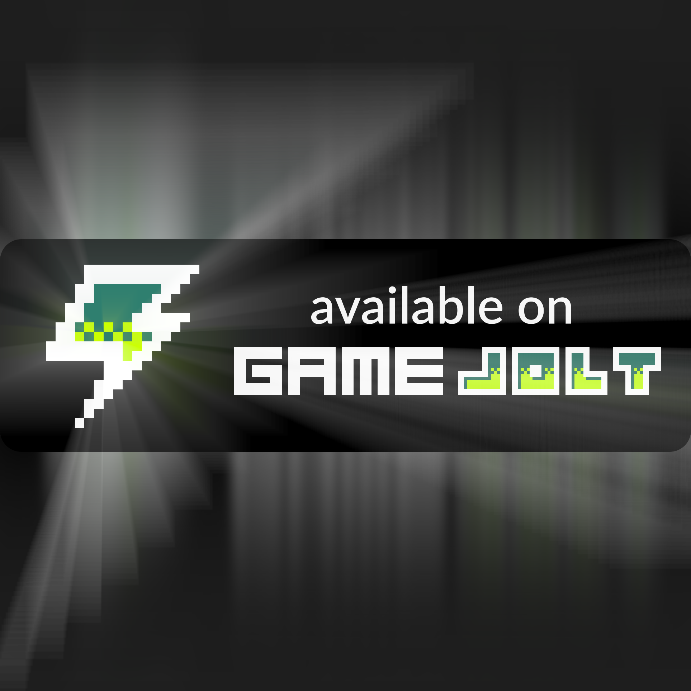

# 👋 Hello, I'm Xavizard Knight

I'm a programmer in my free time (not so good but trying to improve). Learning C# for Unity3D and AvaloniaUI.

I use my GitLab account for my private repos (and some publics ones), but I still use this GitHub account to interact with other projects.

<a>My GitLab account</a>

<!---->

## My projects

<table>
	<tr>
		<td></td>
		<td>
			

				<b>unofficial-gj-badge</b>
				 
			

		</td>
		<td>
		An unofficial "Available on Game Jolt" badge for your games' trailers or promotional art.
		 
		</td>
	</tr>
</table>

<!--
This is the default profile README text. I'll leave it here:
------------------------------------------------------------

**xavizardKnight/xavizardknight** is a ✨ _special_ ✨ repository because its `README.md` (this file) appears on your GitHub profile.

Here are some ideas to get you started:

- 🔭 I’m currently working on ...
- 🌱 I’m currently learning ...
- 👯 I’m looking to collaborate on ...
- 🤔 I’m looking for help with ...
- 💬 Ask me about ...
- 📫 How to reach me: ...
- 😄 Pronouns: ...
- ⚡ Fun fact: ...
-->
